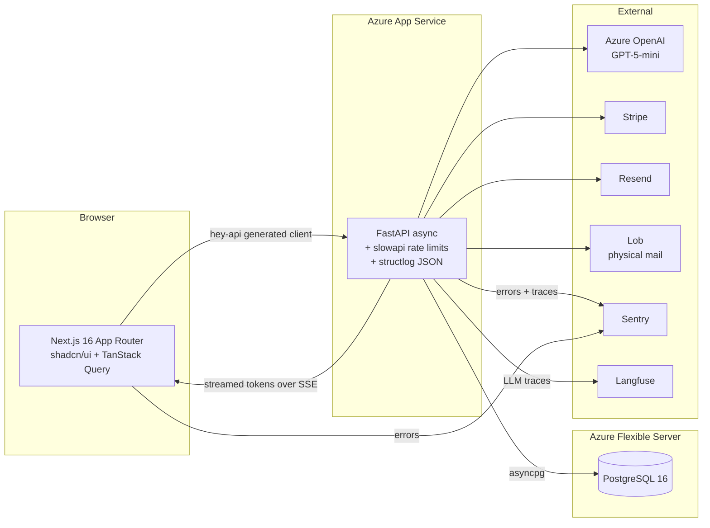

# WadeCV

[](../../actions/workflows/ci.yml)
[](LICENSE)
[](https://www.python.org/downloads/release/python-3120/)
[](https://nextjs.org/)

AI-powered CV tailoring. Upload your CV, paste a job link, get a professionally
tailored resume streamed back in seconds — and optionally a printed copy
mailed to the hiring company via USPS.

Live demo: **[wadecv.com](https://wadecv.com)**

---

## Why this repo is worth reading

This is a solo side project that takes production quality seriously. A few
things worth calling out if you're evaluating the codebase:

- **End-to-end type safety**, with no hand-written API client. Pydantic → OpenAPI →
  `@hey-api/openapi-ts` → TanStack Query. A CI job regenerates the client on
  every PR and fails the build if the diff is non-empty, so backend/frontend
  drift becomes a red build instead of a 422 in production. See
  [ADR 0001](docs/adr/0001-hey-api-client.md).
- **Streaming LLM responses over SSE.** CV generation takes 10–30s; the
  frontend consumes a `text/event-stream` from FastAPI so users see progress
  token-by-token rather than waiting behind a spinner. Langfuse traces every
  call.
- **Zero-downtime deploys via Azure slot swap.** Every merge to `main` ships
  to a warm staging slot, then atomically swaps into production. Rollback is
  a second swap. See [ADR 0002](docs/adr/0002-azure-slot-swap.md).
- **Feature flags in Postgres, not a vendor.** Global kill switch, percentage
  rollout, user allowlist — one table, one FastAPI dependency. Swappable for
  LaunchDarkly in a single file when the cost is worth it.
  See [ADR 0003](docs/adr/0003-feature-flags-in-db.md).
- **Observability that actually works on a solo budget.** Sentry (free tier,
  env-gated — app runs fine without a DSN), `structlog` JSON output with a
  request-ID middleware so every log line across backend services can be
  stitched to one request.
- **CI that gates merges, not just builds.** `ruff`, `pytest` against a real
  Postgres service container (no SQLite stand-in — the prod DB uses JSONB
  and migrations would lie), Vitest, Playwright smoke, `alembic upgrade` +
  `downgrade -1` reversibility check, `gitleaks`, and the OpenAPI drift guard.

## Architecture at a glance



Full architecture doc: [docs/architecture.md](docs/architecture.md).
Runbook (local setup, common failure modes): [docs/runbook.md](docs/runbook.md).

## Tech stack

| Layer | Stack |
|-------|-------|
| Frontend | Next.js 16 (App Router), React 19, TypeScript strict, Tailwind v4, shadcn/ui, TanStack Query, React Hook Form + Zod |
| Backend | FastAPI, Python 3.12, async SQLAlchemy 2.0, Alembic, Pydantic v2, slowapi |
| Database | PostgreSQL 16 (Azure Flexible Server), JSONB for payloads |
| AI | Azure OpenAI (GPT-5-mini) with Langfuse tracing |
| Payments | Stripe (Checkout + webhooks) |
| Email | Resend (transactional + magic links) |
| Physical mail | Lob |
| Observability | Sentry (gated on `SENTRY_DSN`), `structlog` JSON, request-ID middleware |
| Deploys | Azure App Service + ACR, staging-slot swap |
| Tests | pytest + pytest-asyncio + httpx (backend), Vitest + React Testing Library (frontend unit), Playwright (e2e) |
| Tooling | ruff, prettier, pre-commit, gitleaks, Dependabot |

## Quick start

```bash
git clone https://github.com/abhartia/wadecv.git
cd wadecv
cp backend/.env.example backend/.env    # fill in keys you have; unset ones no-op
cp frontend/.env.example frontend/.env.local

# Install pre-commit hooks (runs ruff, prettier, eslint on every commit)
pip install pre-commit && pre-commit install

# One-shot: Postgres, backend, frontend
docker compose up -d
```

Or run each piece manually — see [docs/runbook.md](docs/runbook.md).

## Repo layout

```
wadecv/
├── backend/                FastAPI service
│   ├── app/
│   │   ├── models/         SQLAlchemy ORM models
│   │   ├── schemas/        Pydantic request/response schemas
│   │   ├── routers/        Route handlers (thin; logic lives in services/)
│   │   ├── services/       Business logic (LLM, Stripe, Lob, email)
│   │   ├── middleware/     Request-ID, structured logging
│   │   └── utils/          JWT, password hashing, parsing
│   ├── alembic/versions/   Migrations (reversible, CI-verified)
│   ├── tests/
│   │   ├── api/            Integration tests against real Postgres
│   │   └── test_*.py       Unit tests (CV layout, fit logic)
│   └── pyproject.toml      pytest + ruff config
├── frontend/               Next.js app
│   ├── src/
│   │   ├── app/            App Router pages + error boundaries
│   │   ├── components/     React components (shadcn-composed)
│   │   ├── gen/            Generated hey-api client (checked in, CI-verified)
│   │   ├── hooks/          Custom hooks (feature flags, auth guards)
│   │   └── lib/            Auth context, API helpers
│   ├── e2e/                Playwright specs
│   └── vitest.config.ts    Unit test config
├── docs/
│   ├── adr/                Architecture decision records
│   ├── architecture.md
│   └── runbook.md
├── .github/workflows/
│   ├── ci.yml              PR gate: lint, test, e2e, client-sync, gitleaks
│   └── azure-appservice-cicd.yml  Deploy (slot swap)
└── docker-compose.yml
```

## Testing

```bash
# Backend
cd backend
pytest --cov                 # real Postgres via docker-compose, or CI service container

# Frontend
cd frontend
npm run lint
npm run typecheck
npm test                     # Vitest
npx playwright test          # E2E smoke

# Everything, as pre-commit would see it
pre-commit run --all-files
```

## What I'd do with a real eng team

Called out honestly so reviewers can see the known edges:

- **Load testing.** No k6 suite yet. Unknown throughput ceilings on the LLM
  streaming endpoint.
- **Bundle size gate.** Added `next/bundle-analyzer` to devDeps but no CI
  threshold — would wire `size-limit` once there's a budget to defend.
- **Storybook.** shadcn primitives are solid without it; would add for design-system
  work if more than one person were touching UI.
- **Full OpenTelemetry.** Langfuse covers the LLM path. A proper OTel collector
  is overkill at current volume — I'd add one when we have more than one
  backend service.
- **Admin UI for feature flags.** Today: `UPDATE feature_flags SET enabled = ...`.
  Two screens of shadcn would solve it; deferred until it's annoying.

## License

[MIT](LICENSE).
