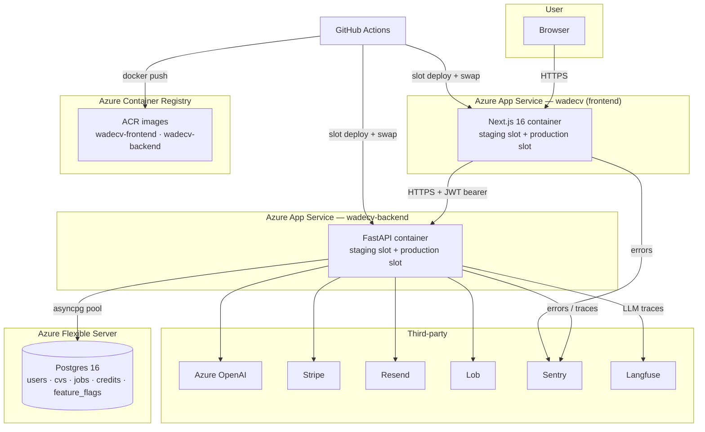
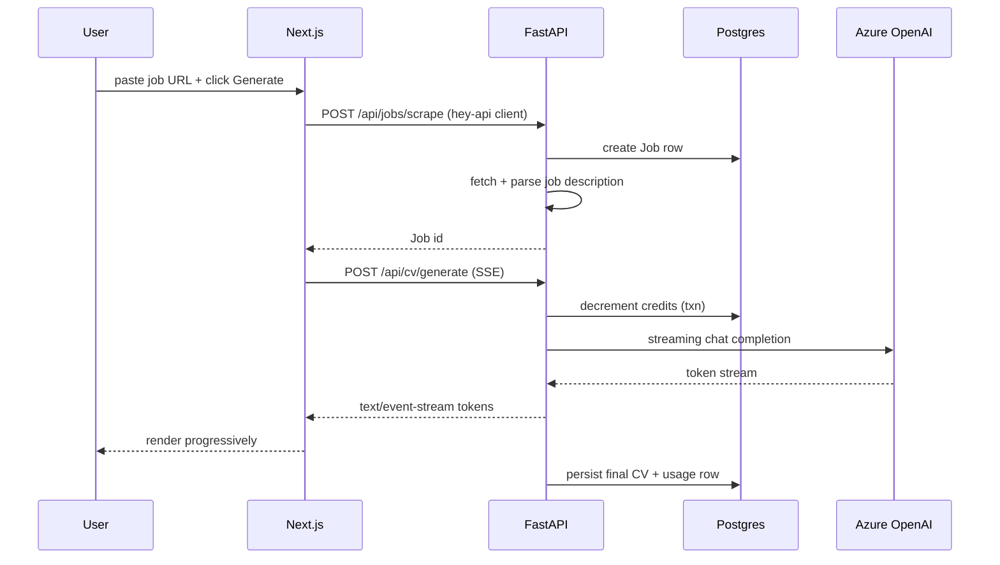
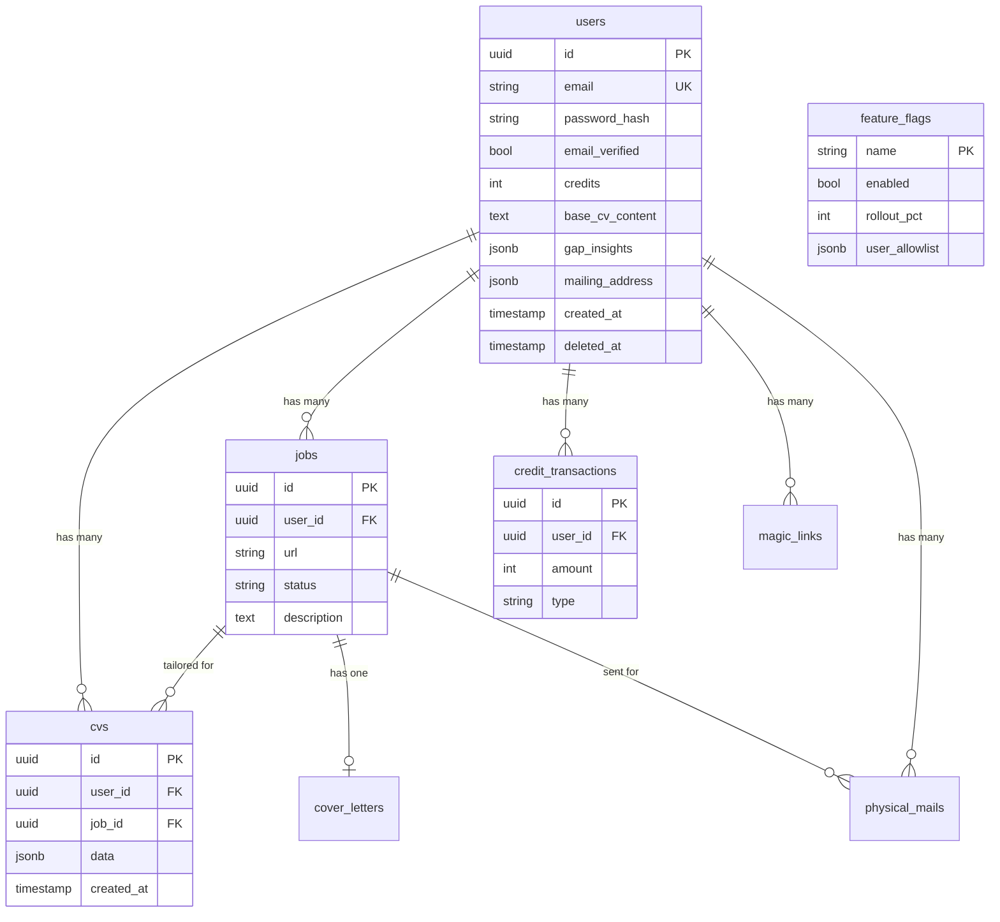

# Architecture

High-level topology, request flow, and schema snapshot. If something in here
contradicts the code, the code wins — open a PR.

## System topology

## Request flow: "generate a tailored CV"

## Data model (current)

## Deploy topology

- Backend: `wadecv-backend.azurewebsites.net` with `staging` and production slots.
- Frontend: `wadecv.com` fronted by App Service with `staging` and production slots.
- Migrations: run as a one-off `alembic upgrade head` step in CI against a
  Postgres service container on every PR, and against prod as part of the
  backend deploy job (before the slot swap).
- Secrets: Azure App Service config, never committed. `gitleaks` blocks
  commits that contain tokens.

## Observability

| Signal | Where | Tool |
|--------|-------|------|
| Exceptions (backend) | FastAPI + background tasks | Sentry (env-gated) |
| Exceptions (frontend) | Next.js app router | Sentry (env-gated) |
| Structured logs | Every request / service call | `structlog` JSON → Azure Log Stream |
| Request correlation | `X-Request-ID` header, propagated into every log line | Middleware |
| LLM traces | Every Azure OpenAI call | Langfuse |
| Rate-limit rejections | 429 responses | `slowapi` + logs |

## Security response headers

Applied at both edges of the stack — see [ADR 0004](adr/0004-security-headers.md)
for the full rationale per header. Frontend baseline lives in
[`frontend/src/lib/security-headers.ts`](../frontend/src/lib/security-headers.ts)
(locked by Vitest + Playwright); backend baseline is
`SecurityHeadersMiddleware` in
[`backend/app/middleware/security_headers.py`](../backend/app/middleware/security_headers.py)
(locked by `backend/tests/api/test_security_headers.py`).

| Header | Value | Edges |
|--------|-------|-------|
| `Strict-Transport-Security` | `max-age=63072000; includeSubDomains; preload` | Frontend always; backend in production only |
| `X-Content-Type-Options` | `nosniff` | Both |
| `X-Frame-Options` | `DENY` | Both |
| `Referrer-Policy` | `strict-origin-when-cross-origin` | Both |
| `Permissions-Policy` | camera/mic/geo/usb/topics/FLoC denied; `payment=(self)` on the frontend for Stripe | Both |
| `Cross-Origin-Opener-Policy` | `same-origin` | Both |
| `Cross-Origin-Resource-Policy` | `same-site` | Backend (API responses) |

Not yet set: `Content-Security-Policy`. A meaningful CSP for this app needs a
nonce-based middleware pass (Next inline hydration script, GA4, Sentry ingest,
Stripe.js, Lob). Tracked as a separate ADR-worthy change.

## Webhook authentication

| Source | Verification | Where |
|--------|--------------|-------|
| Stripe | `stripe.Webhook.construct_event` (HMAC + timestamp) | [`backend/app/routers/webhook.py`](../backend/app/routers/webhook.py) — see [ADR 0005](adr/0005-stripe-webhook-idempotency.md) |
| Resend (Svix) | Stdlib HMAC-SHA256, 5-min replay window, rotation-aware | [`backend/app/utils/svix_signature.py`](../backend/app/utils/svix_signature.py) — see [ADR 0006](adr/0006-resend-webhook-signature-verification.md) |

Both inbound integrations authenticate at the edge before the handler does
any work. Production refuses to boot if either secret is missing.

## Scaling limits known today

- **Pool size** is `settings.db_pool_size` (default 10) + `max_overflow=20`
  per backend instance. At current traffic, one instance handles load with
  headroom. Bump via env var; no code change.
- **Streaming endpoint** holds a worker per concurrent generation for 10–30s.
  At ~50 concurrent users we'd add a second instance; at ~500 we'd move
  generation to a queue (Celery + RQ already considered, deferred).
- **Stripe webhook** is synchronous — acceptable at current volume. Would move
  to a queue-backed handler before a Series-A launch event.
